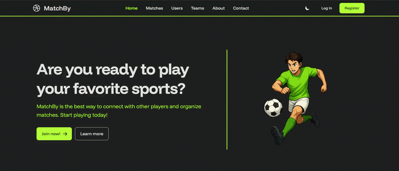
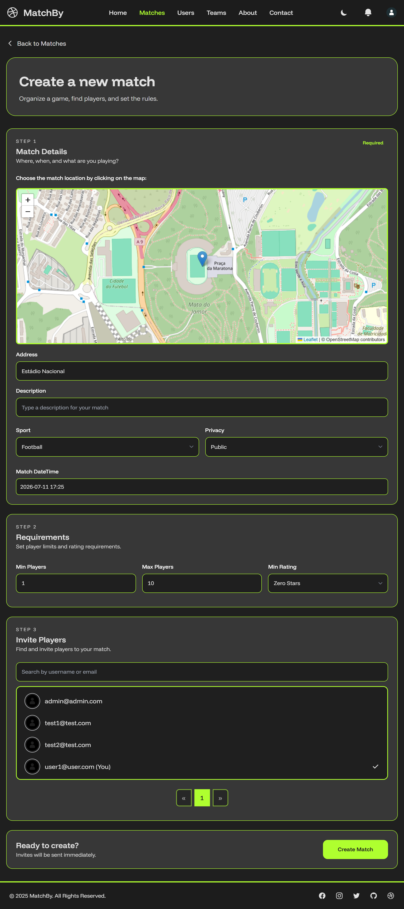
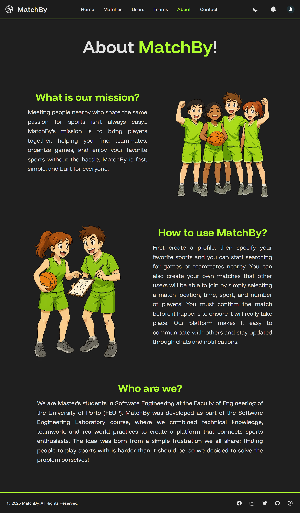

# **MatchBy**

> Web platform for creating, discovering, and joining local sports matches with teams, invites, real-time chat, notifications, and player ratings.

[](https://github.com/goncalosamp27/MatchBy/wiki/Presentation-Demo)

## About the Project

**MatchBy** is a full-stack web application designed to help people organize and participate in local sports matches. The platform allows users to discover nearby games, create public or private matches, manage teams, invite players, chat in real time, and build trust through player ratings.

The project was developed as part of a Master's degree software engineering project, with a focus on building a complete, production-oriented web application using modern .NET technologies.

The application supports two main user roles:

- **Administrators**: manage the platform and access seeded admin-level functionality.
- **Members**: create and join matches, manage teams, send invites, chat with other users, and rate players.

The main goal of the project was to reduce the friction of organizing sports activities by centralizing match discovery, team management, communication, and player coordination in one platform.

## Features

- Register and authenticate users with ASP.NET Core Identity
- Create, edit, search, and join sports matches
- Support public and private matches
- Manage teams with owners, members, privacy settings, and maximum capacity
- Send and receive match invites
- Send and receive team invites
- Manage friends and user connections
- Use real-time chat for private, team, and match conversations
- Send chat messages with text, match invite links, and locations
- Receive real-time notifications through SignalR
- Rate players after matches
- Schedule background jobs for match state processing and match reminders
- Upload and validate user/team images through S3-compatible storage
- Support demo data seeding for local testing
- Run the full project locally with Docker

## Tech Stack

### Web / Frontend

- Blazor Server
- Razor Components
- Blazorise
- Tailwind CSS
- Flowbite Components

### Backend

- ASP.NET Core
- .NET 10
- C#
- ASP.NET Core Identity
- Entity Framework Core
- FluentValidation

### Real-Time Communication

- SignalR
- ChatHub
- NotificationHub

### Background Jobs

- Hangfire
- PostgreSQL-backed job storage
- Scheduled match state processing
- Scheduled match reminder notifications

### Database & Storage

- PostgreSQL 17.2
- Entity Framework Core with Npgsql
- S3-compatible file storage
- Supabase Storage compatible configuration

### Testing & Tooling

- xUnit
- Moq
- Playwright
- Docker
- Docker Compose

## Screenshots

### Home


### Match Creation



### About



## How to Run the Project

### Create the Environment File

Copy the example environment file:

```bash
cp .env.example .env
```

The `.env.example` file already includes local development values for:

- PostgreSQL
- pgAdmin
- Resend placeholder API key
- OAuth placeholder credentials
- Blazorise placeholder token
- S3-compatible storage placeholder settings

> Note: The placeholder values are enough for running the local demo with seeded users. Features that require real external providers, such as OAuth login or real S3 uploads, require valid credentials.

### Start the Application

```bash
docker compose up --build
```

This starts:

- MatchBy web application
- PostgreSQL database
- pgAdmin

The application will be available at:

```
http://localhost:8080
```

pgAdmin will be available at:

```
http://localhost:5050
```

## Demo Accounts

The project seeds demo users automatically in development mode.

| Role | Email | Password |
|---|---|---|
| Admin | admin@admin.com | Admin!123 |
| User | user1@user.com | User1!123 |
| User | user2@user.com | User2!123 |
| Test User | test1@test.com | Test!123 |
| Test User | test2@test.com | Test!123 |

For local testing, use the email/password login form.

> External login providers such as Google, GitHub, and Discord require real provider credentials and are not intended to be used with the default local placeholder values.


## Stop the Project

```bash
docker compose down
```

## Reset the Local Database

```bash
docker compose down -v
docker compose up --build
```

In development mode, the application recreates and seeds the database on startup, so the local environment is always prepared with demo data.

## Running Tests

From the `project/` directory, run:

```bash
dotnet test
```

## Architecture

MatchBy follows a layered architecture with clear separation between UI, business logic, data access, and infrastructure concerns.

### Presentation Layer

The presentation layer is built with Blazor Server and Razor Components. It includes pages for authentication, matches, teams, chat, users, profile management, and static content such as About and Contact pages.

### Application / Service Layer

The service layer contains the main business logic for:

- Matches
- Match invites
- Teams
- Team invites
- Users
- Friends
- Conversations
- Chat messages
- Notifications
- Player ratings
- Background jobs
- File validation
- Image refresh
- Email sending
- S3-compatible storage

### Data Access Layer

The data layer uses Entity Framework Core with PostgreSQL. It includes:

- `ApplicationDbContext`
- Entity configurations
- Database migrations
- Development seeders
- Repository classes for domain access

### Real-Time Layer

SignalR is used for real-time communication through:

- `ChatHub`
- `NotificationHub`

This enables live chat and notification updates without requiring manual page refreshes.

### Background Processing

Hangfire is used to run recurring background jobs, including:

- Processing match states
- Sending match reminders

The Hangfire dashboard is available at:

```txt
http://localhost:8080/hangfire
```

## Main Domain Models

The project includes the following core domain entities:

- `ApplicationUser`
- `Match`
- `Team`
- `Friend`
- `Invite`
- `MatchInvite`
- `TeamInvite`
- `Conversation`
- `ChatMessage`
- `Notification`
- `PlayerRating`

These models support the main platform flows: creating matches, joining teams, inviting users, chatting, receiving notifications, and rating players.

## Project Documentation

Additional documentation is available in the [wiki](https://github.com/goncalosamp27/MatchBy/wiki).
